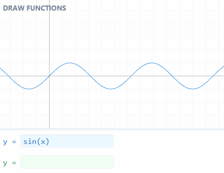

# DRAW FUNCTIONS

[Dibujar y comparar funciones matemáticas.](https://mauroc8.github.io/draw-functions/)

[ENTRAR AHORA!](https://mauroc8.github.io/draw-functions/)

## Referencia de sintaxis

Usamos los símbolos `+`, `-`, `*` y `/` para sumar, restar, multiplicar y dividir (respectivamente).

Usamos `^` para la potenciación. Por ejemplo, _x²_ se escribe como `x^2`.

Hay una forma más simple de multiplicar. `2*x` puede ser escrito como `2x`.

> Nota: `1/2*x` es equivalente a `(1/2)*x`, pero `1/2x` es equivalente a `1/(2*x)`. En otras palabras, la multiplicación sin usar el `*` tiene más [precedencia](https://es.wikipedia.org/wiki/Orden_de_evaluaci%C3%B3n).

Usamos `sin(...)` para escribir funciones. Las funciones que se pueden usar son `sin` (o `sen`), `cos`, `tan`, `asin` (o `asen`), `acos`, `atan`, `abs` (valor absoluto) y `sqrt` (raíz cuadrada).

> La raíz n-ésima de `x` se puede escribir como `x^(1/n)`, donde `n` es un número o una expresión.

## Motivación

> Esta mini-aplicación es un _remake_ de una que hice hace unos años. Para ver la versión vieja, [entrar aquí](https://github.com/mauroc8/graficar).

Esta aplicación te permite dibujar y comparar funciones matemáticas en un sistema de coordenadas 2D.

Hay muchas aplicaciones que permiten dibujar funciones. La más conocida es [Wolfram Alpha](https://www.wolframalpha.com/). Sin embargo, hay cosas que con Wolfram Alpha no se pueden hacer:

-   **Dibujar funciones rápidamente.** Incluso la función más simple, como `y = x`, puede tomar hasta 2 segundos en dibujarse. Con esta aplicación, un@ puede ver el _feedback_ instantáneo a medida que escribe.
-   **Mover y hacer _zoom_.** Los gráficos de funciones en Wolfram Alpha son muy pequeños, y no se pueden agrandar a menos que pagues el plan Pro.

Por otro lado, hay **millones** de cosas que se pueden hacer con Wolfram Alpha y no con esta aplicación. **El objetivo no es competir con Wolfram Alpha!**

La principal motivación para hacer esta aplicación fue aprender acerca de [parseo](https://en.wikipedia.org/wiki/Parsing). Me resultó _muy_ útil a lo largo de los años cuando estudiaba materias relacionadas con cálculo.

> Para leer cómo configurar el servidor de desarrollo y cómo hacer builds, ver el [README en inglés](https://github.com/mauroc8/draw-functions).
